# Roster ERD

Mermaid entity-relationship diagram for the Roster workforce-scheduling schema.

```mermaid
erDiagram
    companies {
        uuid id PK
        varchar name
        varchar slug UK
        varchar timezone
        varchar locale
        enum status
        text branding_logo_url
        varchar branding_primary_color
        boolean hipaa_enabled
        integer data_retention_days
        timestamptz created_at
        timestamptz deleted_at
    }

    company_settings {
        uuid company_id PK, FK
        integer overtime_threshold_hours
        integer overtime_daily_threshold_hours
        integer min_rest_hours
        integer meal_break_threshold_minutes
        integer meal_break_duration_minutes
        integer rest_break_threshold_minutes
        integer reminder_lead_minutes
        boolean daily_digest_enabled
        boolean self_scheduling_enabled
        boolean gps_required
        boolean break_tracking_enabled
        integer predictive_scheduling_days
        inet[] allowed_ip_ranges
        boolean mlts_enabled
        varchar data_residency_region
        timestamptz updated_at
    }

    locations {
        uuid id PK
        uuid company_id FK
        varchar name
        text address
        varchar city
        varchar state_province
        varchar country
        varchar timezone
        decimal latitude
        decimal longitude
        integer geofence_radius_meters
        boolean is_active
        timestamptz created_at
        timestamptz deleted_at
    }

    positions {
        uuid id PK
        uuid company_id FK
        varchar name
        text description
        decimal pay_rate
        boolean is_active
        timestamptz created_at
        timestamptz deleted_at
    }

    skills {
        uuid id PK
        uuid company_id FK
        varchar name
        text description
        boolean is_active
        timestamptz created_at
    }

    position_skills {
        uuid id PK
        uuid position_id FK
        uuid skill_id FK
        boolean is_required
    }

    teams {
        uuid id PK
        uuid company_id FK
        uuid location_id FK
        varchar name
        uuid manager_id FK
        timestamptz created_at
        timestamptz deleted_at
    }

    people {
        uuid id PK
        uuid company_id FK
        uuid team_id FK
        uuid location_id FK
        uuid position_id FK
        varchar employee_id
        varchar name
        citext email
        varchar phone
        varchar password_hash
        varchar timezone
        enum role
        enum status
        boolean mfa_enabled
        varchar mfa_secret
        timestamptz invited_at
        timestamptz invite_accepted_at
        varchar subscription_token UK
        timestamptz data_exported_at
        varchar invite_token UK
        uuid invited_by FK
        decimal hourly_rate
        timestamptz created_at
        timestamptz deleted_at
    }

    team_memberships {
        uuid id PK
        uuid team_id FK
        uuid person_id FK
        enum role
        timestamptz created_at
    }

    person_skills {
        uuid id PK
        uuid person_id FK
        uuid skill_id FK
        date acquired_at
        date expires_at
        timestamptz created_at
    }

    shift_templates {
        uuid id PK
        uuid company_id FK
        uuid team_id FK
        uuid position_id FK
        varchar title
        text description
        integer duration_minutes
        time start_time
        integer required_count
        integer max_count
        boolean is_active
        timestamptz created_at
        timestamptz updated_at
    }

    template_skills {
        uuid id PK
        uuid shift_template_id FK
        uuid skill_id FK
        integer min_count
    }

    recurrence_rules {
        uuid id PK
        uuid shift_template_id FK, UK
        text rrule_string
        timestamptz dtstart
        timestamptz dtend
        timestamptz[] exdates
        boolean skip_holidays
        timestamptz created_at
    }

    shifts {
        uuid id PK
        uuid company_id FK
        uuid team_id FK
        uuid location_id FK
        uuid template_id FK
        uuid position_id FK
        varchar title
        timestamptz start_at
        timestamptz end_at
        varchar timezone
        integer required_count
        integer max_count
        enum status
        uuid recurrence_id
        boolean is_exception
        timestamptz created_at
        timestamptz updated_at
    }

    shift_skills {
        uuid id PK
        uuid shift_id FK
        uuid skill_id FK
        integer min_count
    }

    shift_assignments {
        uuid id PK
        uuid shift_id FK
        uuid person_id FK
        enum status
        timestamptz requested_at
        timestamptz approved_at
        uuid approved_by FK
        timestamptz cancelled_at
        timestamptz confirmed_at
    }

    shift_swap_requests {
        uuid id PK
        uuid shift_assignment_id FK
        uuid requester_id FK
        uuid target_id FK
        enum status
        boolean manager_approved
        uuid manager_id FK
        timestamptz created_at
        timestamptz resolved_at
    }

    clock_entries {
        uuid id PK
        uuid shift_assignment_id FK
        uuid person_id FK
        uuid company_id FK
        uuid location_id FK
        timestamptz clock_in_at
        timestamptz clock_out_at
        timestamptz break_in_at
        timestamptz break_out_at
        integer break_duration_minutes
        integer duration_minutes
        decimal latitude
        decimal longitude
        text notes
        inet source_ip
        timestamptz created_at
    }

    time_off_requests {
        uuid id PK
        uuid company_id FK
        uuid person_id FK
        enum type
        timestamptz start_at
        timestamptz end_at
        boolean is_partial_day
        text reason
        text document_url
        enum status
        uuid reviewed_by FK
        timestamptz reviewed_at
        timestamptz created_at
        timestamptz updated_at
    }

    holidays {
        uuid id PK
        uuid company_id FK
        varchar name
        date date
        boolean is_recurring
        boolean paid
        timestamptz created_at
    }

    notifications {
        uuid id PK
        uuid company_id FK
        uuid person_id FK
        varchar type
        enum channel
        varchar subject
        text body
        enum status
        timestamptz sent_at
        timestamptz read_at
        timestamptz created_at
    }

    notification_preferences {
        uuid id PK
        uuid person_id FK
        varchar type
        enum channel
        boolean enabled
    }

    integrations {
        uuid id PK
        uuid company_id FK
        varchar type
        varchar name
        jsonb config
        boolean is_active
        timestamptz last_sent_at
        text last_error
        timestamptz created_at
        timestamptz updated_at
    }

    feature_flags {
        uuid id PK
        uuid company_id FK
        varchar flag
        boolean enabled
        timestamptz updated_at
    }

    audit_entries {
        uuid id PK
        uuid company_id FK
        uuid actor_id FK
        varchar resource_type
        uuid resource_id
        varchar action
        jsonb old_values
        jsonb new_values
        inet ip_address
        text user_agent
        varchar prev_hash
        varchar hash
        timestamptz created_at
    }

    sessions {
        uuid id PK
        uuid company_id FK
        uuid person_id FK
        varchar token_hash
        varchar refresh_token_hash
        inet ip_address
        text user_agent
        timestamptz expires_at
        timestamptz last_used_at
        timestamptz created_at
        timestamptz revoked_at
    }

    password_reset_tokens {
        uuid id PK
        uuid company_id FK
        uuid person_id FK
        varchar token_hash
        timestamptz expires_at
        timestamptz used_at
        timestamptz created_at
    }

    consent_records {
        uuid id PK
        uuid company_id FK
        uuid person_id FK
        varchar type
        boolean granted
        inet ip_address
        timestamptz granted_at
        timestamptz revoked_at
    }

    region_routing {
        uuid company_id PK, FK
        varchar region
        timestamptz assigned_at
    }

    compliance_violations {
        uuid id PK
        uuid company_id FK
        uuid person_id FK
        uuid shift_assignment_id FK
        enum violation_type
        varchar severity
        text description
        timestamptz detected_at
        varchar detected_by
        enum status
        timestamptz acknowledged_at
        uuid acknowledged_by FK
        timestamptz resolved_at
        uuid resolved_by FK
        text notes
    }

    companies ||--|| company_settings : "1:1"
    companies ||--o{ locations : has
    companies ||--o{ positions : has
    companies ||--o{ skills : has
    companies ||--o{ teams : has
    companies ||--o{ people : has
    companies ||--o{ shift_templates : has
    companies ||--o{ shifts : has
    companies ||--o{ clock_entries : has
    companies ||--o{ time_off_requests : has
    companies ||--o{ holidays : has
    companies ||--o{ notifications : has
    companies ||--o{ integrations : has
    companies ||--o{ feature_flags : has
    companies ||--o{ audit_entries : has
    companies ||--o{ sessions : has
    companies ||--o{ password_reset_tokens : has
    companies ||--o{ consent_records : has
    companies ||--|| region_routing : "1:1"
    companies ||--o{ compliance_violations : has

    locations ||--o{ teams : has
    locations ||--o{ people : has
    locations ||--o{ shifts : has
    locations ||--o{ clock_entries : has

    positions ||--o{ people : has
    positions ||--o{ shift_templates : has
    positions ||--o{ shifts : has
    positions ||--o{ position_skills : has

    skills ||--o{ position_skills : has
    skills ||--o{ person_skills : has
    skills ||--o{ template_skills : has
    skills ||--o{ shift_skills : has

    teams ||--o{ people : has
    teams ||--o{ team_memberships : has
    teams ||--o{ shift_templates : has
    teams ||--o{ shifts : has

    people ||--o{ teams : manages
    people ||--o{ people : invited
    people ||--o{ team_memberships : has
    people ||--o{ person_skills : has
    people ||--o{ shift_assignments : has
    people ||--o{ shift_swap_requests : requests
    people ||--o{ shift_swap_requests : targeted
    people ||--o{ shift_swap_requests : approves
    people ||--o{ clock_entries : has
    people ||--o{ time_off_requests : has
    people ||--o{ time_off_requests : reviews
    people ||--o{ notifications : has
    people ||--o{ notification_preferences : has
    people ||--o{ sessions : has
    people ||--o{ password_reset_tokens : has
    people ||--o{ consent_records : has
    people ||--o{ audit_entries : acts
    people ||--o{ compliance_violations : has
    people ||--o{ compliance_violations : acknowledges
    people ||--o{ compliance_violations : resolves

    shift_templates ||--o{ recurrence_rules : has
    shift_templates ||--o{ template_skills : has
    shift_templates ||--o{ shifts : generates

    shifts ||--o{ shift_skills : has
    shifts ||--o{ shift_assignments : has

    shift_assignments ||--o{ shift_swap_requests : has
    shift_assignments ||--o{ clock_entries : has
    shift_assignments ||--o{ compliance_violations : has
```



## Viewing this diagram

- **GitHub / GitLab**: open this file — the diagram renders automatically.
- **VS Code**: install the [Markdown Preview Mermaid Support](https://marketplace.visualstudio.com/items?itemName=bierner.markdown-mermaid) extension.
- **CLI / CI**: use [`mermaid-cli`](https://github.com/mermaid-js/mermaid-cli) to export to PNG/SVG/PDF:
  ```bash
  npx @mermaid-js/mermaid-cli -i er/roster-erd.md -o er/roster-erd.svg
  ```
- **Live editor**: paste the diagram block into [https://mermaid.live](https://mermaid.live).
